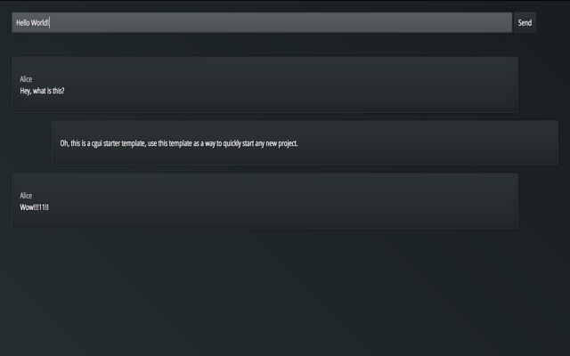

# cgui
Conversational Graphic User Interface

Please note how src/app.css is a nearly empty stylesheet, and dist/app.css has been filled with CSS rules, this is due to use of PostCSS and [revolutionize](https://github.com/fantasyui-com/revolutionize) plugin for CSS enrichment.

## Preview and Live Demo

[demo](https://rawgit.com/fantasyui-com/cgui/master/dist/index.html) (via rawgit.com)

### Glass

### Tint

### Charcoal

### Solar

### Deep

### Cream

